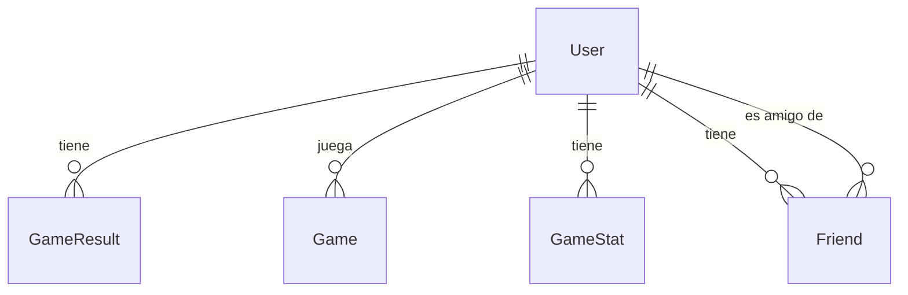
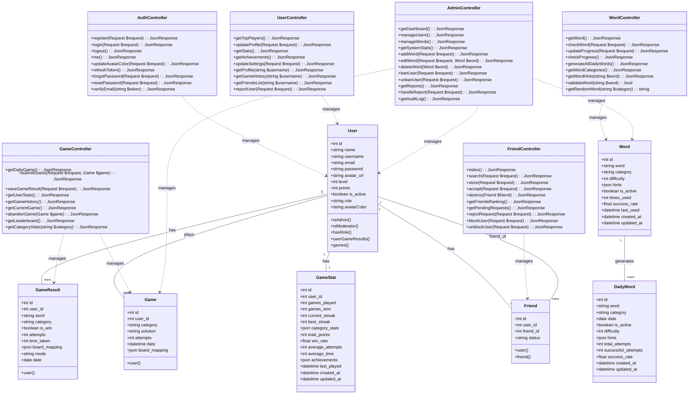
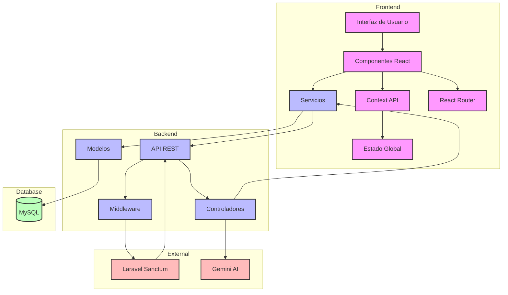

# 🎮 Geekdle

<div align="center">
  
  
  [](https://reactjs.org/)
  [](https://laravel.com/)
  [](https://tailwindcss.com/)
  [](LICENSE.md)
</div>

## 📚 Índice
- [Descripción](#-descripción)
- [Características](#-características)
- [Tecnologías](#-tecnologías)
- [Arquitectura](#-arquitectura)
- [Instalación](#-instalación)
- [Desarrollo](#-desarrollo)
- [API](#-api)
- [Base de Datos](#-base-de-datos)
- [Despliegue](#-despliegue)
- [Contribución](#-contribución)

## 🎯 Descripción

Geekdle es un juego de palabras inspirado en Wordle pero con temática geek. Los jugadores deben adivinar palabras relacionadas con tecnología, videojuegos, series, películas y cultura geek en general.

### 🎮 Demo
[Jugar Geekdle](https://geekdle.com)

## ✨ Características

### Sistema de Juego
- 🎯 Múltiples categorías de palabras
- 🎮 Modos de juego:
  - Modo Diario (nueva palabra cada día)
  - Modo Infinito (sin límites)
- 💡 Sistema de pistas con costo de puntos
- ⌨️ Teclado virtual con retroalimentación visual
- ✨ Animaciones fluidas y efectos visuales

### Características Sociales
- 👥 Sistema de amigos y desafíos
- 🏆 Ranking global y entre amigos
- 👤 Perfiles personalizables
- 📊 Historial de partidas
- 🔗 Compartir resultados

### Sistema de Progresión
- 📈 Niveles de usuario
- 🎯 Puntos acumulados
- 🏅 Logros y medallas
- 📊 Estadísticas detalladas
- 📈 Gráficos de progreso

## 🎨 Guía de Estilo

### Paleta de Colores

#### Colores Principales
- **Primario**: `#4F46E5` (Indigo)
  - Usado para: Botones principales, enlaces, elementos destacados
  - Variantes:
    - Claro: `#818CF8`
    - Oscuro: `#3730A3`
    - Hover: `#4338CA`

- **Secundario**: `#10B981` (Verde Esmeralda)
  - Usado para: Éxitos, confirmaciones, estados positivos
  - Variantes:
    - Claro: `#34D399`
    - Oscuro: `#059669`
    - Hover: `#059669`

- **Acento**: `#F59E0B` (Ámbar)
  - Usado para: Alertas, advertencias, elementos de atención
  - Variantes:
    - Claro: `#FBBF24`
    - Oscuro: `#D97706`
    - Hover: `#D97706`

#### Colores de Estado
- **Éxito**: `#10B981` (Verde)
- **Error**: `#EF4444` (Rojo)
- **Advertencia**: `#F59E0B` (Ámbar)
- **Info**: `#3B82F6` (Azul)

#### Colores de Fondo
- **Principal**: `#FFFFFF` (Blanco)
- **Secundario**: `#F3F4F6` (Gris Claro)
- **Terciario**: `#1F2937` (Gris Oscuro)
- **Modal**: `#FFFFFF` con opacidad 95%

### Tipografía

#### Fuentes
- **Principal**: 'Inter'
  - Usada para: Texto general, navegación, contenido
- **Secundaria**: 'Poppins'
  - Usada para: Títulos, encabezados, elementos destacados
- **Monospace**: 'JetBrains Mono'
  - Usada para: Código, teclado virtual

#### Tamaños
- **Títulos**:
  - H1: `2.5rem` (40px)
  - H2: `2rem` (32px)
  - H3: `1.75rem` (28px)
  - H4: `1.5rem` (24px)
  - H5: `1.25rem` (20px)
  - H6: `1rem` (16px)

- **Texto**:
  - Grande: `1.125rem` (18px)
  - Normal: `1rem` (16px)
  - Pequeño: `0.875rem` (14px)
  - Muy pequeño: `0.75rem` (12px)

#### Pesos
- Regular: `400`
- Medium: `500`
- Semibold: `600`
- Bold: `700`

### Componentes

#### Botones
- **Primario**:
  - Fondo: Color primario
  - Texto: Blanco
  - Padding: `0.75rem 1.5rem`
  - Border Radius: `0.5rem`
  - Sombra: `0 1px 2px rgba(0, 0, 0, 0.05)`

- **Secundario**:
  - Fondo: Blanco
  - Borde: Color primario
  - Texto: Color primario
  - Padding: `0.75rem 1.5rem`
  - Border Radius: `0.5rem`

- **Terciario**:
  - Fondo: Transparente
  - Texto: Color primario
  - Padding: `0.75rem 1.5rem`

#### Inputs
- **Campos de texto**:
  - Altura: `2.5rem`
  - Padding: `0.75rem 1rem`
  - Border Radius: `0.5rem`
  - Borde: `1px solid #E5E7EB`
  - Focus: Borde color primario

- **Checkboxes y Radios**:
  - Tamaño: `1.25rem`
  - Color: Color primario
  - Border Radius: `0.25rem`

#### Cards
- **Contenedor**:
  - Fondo: Blanco
  - Border Radius: `1rem`
  - Sombra: `0 4px 6px -1px rgba(0, 0, 0, 0.1)`
  - Padding: `1.5rem`

- **Header**:
  - Padding: `1rem 1.5rem`
  - Borde inferior: `1px solid #E5E7EB`

- **Body**:
  - Padding: `1.5rem`

- **Footer**:
  - Padding: `1rem 1.5rem`
  - Borde superior: `1px solid #E5E7EB`

### Espaciado

#### Sistema de Grid
- **Columnas**: 12
- **Gutter**: `1.5rem`
- **Breakpoints**:
  - Mobile: `640px`
  - Tablet: `768px`
  - Desktop: `1024px`
  - Large: `1280px`

#### Espaciado Vertical
- **Secciones**: `4rem`
- **Componentes**: `2rem`
- **Elementos**: `1rem`
- **Interno**: `0.5rem`

### Iconografía
- **Sistema**: Heroicons
- **Tamaños**:
  - Pequeño: `1rem`
  - Normal: `1.5rem`
  - Grande: `2rem`
- **Estilo**: Outline
- **Color**: Heredado del texto

### Animaciones

#### Transiciones
- **Duración**:
  - Rápida: `150ms`
  - Normal: `300ms`
  - Lenta: `500ms`
- **Timing**: `cubic-bezier(0.4, 0, 0.2, 1)`

#### Efectos
- **Hover**: Escala `1.05`
- **Active**: Escala `0.95`
- **Focus**: Outline con color primario
- **Loading**: Spinner con color primario

### Responsive Design

#### Mobile First
- **Base**: Estilos para móvil
- **Tablet**: `@media (min-width: 768px)`
- **Desktop**: `@media (min-width: 1024px)`
- **Large**: `@media (min-width: 1280px)`

#### Breakpoints
- **Mobile**: `< 640px`
- **Tablet**: `640px - 1023px`
- **Desktop**: `1024px - 1279px`
- **Large**: `≥ 1280px`

### Accesibilidad

#### Contraste
- **Texto normal**: Ratio mínimo 4.5:1
- **Texto grande**: Ratio mínimo 3:1
- **Elementos interactivos**: Ratio mínimo 3:1

#### Focus
- **Visible**: Outline `2px solid` color primario
- **Skip Links**: Visibles al focus
- **Keyboard Navigation**: Tab order lógico

#### ARIA
- **Roles**: Semánticos y ARIA
- **Labels**: Descriptivos y únicos
- **States**: Actualizados dinámicamente

### Dark Mode

#### Colores
- **Fondo**: `#1F2937`
- **Texto**: `#F9FAFB`
- **Bordes**: `#374151`
- **Hover**: `#4B5563`

#### Componentes
- **Cards**: `#374151`
- **Inputs**: `#4B5563`
- **Botones**: Ajustados para contraste
- **Iconos**: Invertidos cuando necesario

## 📚 Documentación del Código

### 5.1. Estructura de Carpetas

#### Frontend (`/frontend`)
```
frontend/
├── public/                 # Archivos estáticos públicos
│   ├── assets/            # Imágenes, fuentes, etc.
│   └── index.html         # Punto de entrada HTML
├── src/
│   ├── components/        # Componentes reutilizables
│   │   ├── common/        # Componentes comunes (botones, inputs)
│   │   ├── game/          # Componentes específicos del juego
│   │   ├── layout/        # Componentes de estructura
│   │   └── ui/            # Componentes de interfaz
│   ├── context/           # Contextos de React
│   │   ├── AuthContext    # Gestión de autenticación
│   │   ├── GameContext    # Estado del juego
│   │   └── ThemeContext   # Gestión de tema
│   ├── hooks/             # Custom hooks
│   │   ├── useAuth        # Hook de autenticación
│   │   ├── useGame        # Hook de juego
│   │   └── useTheme       # Hook de tema
│   ├── pages/             # Páginas de la aplicación
│   │   ├── Home           # Página principal
│   │   ├── Game           # Página de juego
│   │   ├── Profile        # Perfil de usuario
│   │   └── Leaderboard    # Tabla de clasificación
│   ├── services/          # Servicios de API
│   │   ├── api            # Configuración de Axios
│   │   ├── auth           # Servicios de autenticación
│   │   └── game           # Servicios de juego
│   ├── styles/            # Estilos globales
│   │   ├── globals.css    # Estilos base
│   │   └── themes/        # Temas de la aplicación
│   ├── utils/             # Utilidades
│   │   ├── constants      # Constantes
│   │   ├── helpers        # Funciones auxiliares
│   │   └── validation     # Validaciones
│   ├── App.tsx            # Componente raíz
│   └── main.tsx           # Punto de entrada
└── package.json           # Dependencias y scripts
```

**Justificación**:
- **Componentes**: Separación por funcionalidad para mejor mantenimiento
- **Context**: Centralización del estado global
- **Hooks**: Reutilización de lógica común
- **Pages**: Organización por rutas
- **Services**: Separación de la lógica de API
- **Utils**: Funciones auxiliares reutilizables

#### Backend (`/backend`)
```
backend/
├── app/
│   ├── Http/
│   │   ├── Controllers/   # Controladores
│   │   ├── Middleware/    # Middleware
│   │   └── Requests/      # Form Requests
│   ├── Models/            # Modelos Eloquent
│   ├── Services/          # Servicios de negocio
│   └── Exceptions/        # Excepciones personalizadas
├── config/                # Configuraciones
├── database/
│   ├── migrations/        # Migraciones
│   ├── seeders/          # Seeders
│   └── factories/        # Factories
├── routes/
│   ├── api.php           # Rutas de API
│   └── web.php           # Rutas web
├── tests/                # Tests
│   ├── Feature/          # Tests de integración
│   └── Unit/             # Tests unitarios
└── artisan               # CLI de Laravel
```

**Justificación**:
- **Controllers**: Separación de responsabilidades
- **Services**: Lógica de negocio reutilizable
- **Models**: Interacción con la base de datos
- **Middleware**: Procesamiento de peticiones
- **Tests**: Cobertura de código

### 5.2. Descripción de Clases y Componentes

#### Frontend

##### Componentes Principales
1. **GameBoard**
   - **Propósito**: Tablero principal del juego
   - **Props**:
     - `word`: Palabra a adivinar
     - `attempts`: Intentos realizados
     - `onGuess`: Callback para intentos
     - `maxAttempts`: Máximo de intentos permitidos
     - `category`: Categoría de la palabra
   - **Estado**:
     - `currentAttempt`: Intento actual
     - `boardState`: Estado del tablero
     - `gameStatus`: Estado del juego (playing, won, lost)
   - **Funcionalidades**:
     - Validación de intentos
     - Animaciones de letras
     - Retroalimentación visual

2. **Keyboard**
   - **Propósito**: Teclado virtual
   - **Props**:
     - `onKeyPress`: Callback para teclas
     - `usedKeys`: Teclas utilizadas
     - `disabled`: Estado de deshabilitación
     - `layout`: Distribución de teclas
   - **Estado**:
     - `keyStates`: Estado de las teclas
     - `activeKey`: Tecla actual
   - **Funcionalidades**:
     - Soporte para teclado físico
     - Animaciones de teclas
     - Sonidos de teclas
     - Modo táctil

3. **GameStats**
   - **Propósito**: Estadísticas del juego
   - **Props**:
     - `stats`: Objeto de estadísticas
     - `onReset`: Callback para reinicio
     - `userId`: ID del usuario
     - `timezone`: Zona horaria
   - **Estado**:
     - `isExpanded`: Estado de expansión
     - `timeRange`: Rango de tiempo
     - `categoryFilter`: Filtro por categoría
   - **Funcionalidades**:
     - Gráficos de progreso
     - Exportación de datos
     - Filtros temporales
     - Comparativas

4. **ProfileCard**
   - **Propósito**: Perfil de usuario
   - **Props**:
     - `user`: Datos del usuario
     - `onEdit`: Callback para edición
     - `achievements`: Logros
     - `isEditable`: Permiso de edición
   - **Estado**:
     - `isEditing`: Modo edición
     - `avatarColor`: Color del avatar
   - **Funcionalidades**:
     - Edición de perfil
     - Cambio de avatar
     - Visualización de logros
     - Estadísticas personales

5. **Leaderboard**
   - **Propósito**: Tabla de clasificación
   - **Props**:
     - `data`: Datos de clasificación
     - `timeRange`: Rango de tiempo
     - `category`: Categoría
     - `onFilter`: Callback de filtrado
   - **Estado**:
     - `sortBy`: Campo de ordenación
     - `sortOrder`: Orden (asc/desc)
     - `page`: Página actual
   - **Funcionalidades**:
     - Paginación
     - Ordenación
     - Filtros
     - Exportación

6. **FriendList**
   - **Propósito**: Lista de amigos
   - **Props**:
     - `friends`: Lista de amigos
     - `onAdd`: Callback para añadir
     - `onRemove`: Callback para eliminar
     - `onChallenge`: Callback para desafiar
   - **Estado**:
     - `searchQuery`: Búsqueda
     - `filterStatus`: Filtro de estado
   - **Funcionalidades**:
     - Búsqueda de amigos
     - Gestión de solicitudes
     - Desafíos
     - Chat

7. **DailyChallenge**
   - **Propósito**: Desafío diario
   - **Props**:
     - `word`: Palabra del día
     - `hints`: Pistas disponibles
     - `onComplete`: Callback de completado
     - `difficulty`: Dificultad
   - **Estado**:
     - `attempts`: Intentos realizados
     - `hintsUsed`: Pistas usadas
     - `timeLeft`: Tiempo restante
   - **Funcionalidades**:
     - Temporizador
     - Sistema de pistas
     - Recompensas
     - Compartir resultados

##### Contextos
1. **AuthContext**
   - **Estado**:
     - `user`: Usuario actual
     - `isAuthenticated`: Estado de autenticación
     - `token`: Token de acceso
     - `refreshToken`: Token de actualización
   - **Métodos**:
     - `login`: Inicio de sesión
     - `logout`: Cierre de sesión
     - `register`: Registro
     - `refreshToken`: Actualizar token
     - `updateProfile`: Actualizar perfil
     - `resetPassword`: Restablecer contraseña

2. **GameContext**
   - **Estado**:
     - `currentGame`: Juego actual
     - `gameState`: Estado del juego
     - `history`: Historial de juegos
     - `stats`: Estadísticas
   - **Métodos**:
     - `startGame`: Iniciar juego
     - `makeGuess`: Realizar intento
     - `endGame`: Finalizar juego
     - `saveProgress`: Guardar progreso
     - `loadGame`: Cargar juego
     - `resetGame`: Reiniciar juego

3. **ThemeContext**
   - **Estado**:
     - `theme`: Tema actual
     - `isDark`: Modo oscuro
     - `colors`: Paleta de colores
   - **Métodos**:
     - `toggleTheme`: Cambiar tema
     - `setTheme`: Establecer tema
     - `getColor`: Obtener color
     - `updateColors`: Actualizar colores

#### Backend

##### Modelos
1. **User**
   - **Atributos**:
     - `name`, `email`, `password`
     - `level`, `points`, `role`
     - `avatar_url`, `avatarColor`
     - `is_active`, `last_login`
   - **Relaciones**:
     - `games`: Partidas jugadas
     - `stats`: Estadísticas
     - `friends`: Amigos
     - `achievements`: Logros
   - **Métodos**:
     - `isAdmin`: Verificar rol
     - `updateStats`: Actualizar estadísticas
     - `addPoints`: Añadir puntos
     - `checkAchievements`: Verificar logros

2. **Game**
   - **Atributos**:
     - `word`, `category`
     - `attempts`, `status`
     - `start_time`, `end_time`
     - `difficulty`, `hints_used`
   - **Relaciones**:
     - `user`: Jugador
     - `results`: Resultados
     - `word`: Palabra
   - **Métodos**:
     - `calculateScore`: Calcular puntuación
     - `checkWin`: Verificar victoria
     - `getHints`: Obtener pistas
     - `updateProgress`: Actualizar progreso

3. **Word**
   - **Atributos**:
     - `word`, `category`
     - `difficulty`, `hints`
     - `times_used`, `success_rate`
     - `is_active`, `last_used`
   - **Relaciones**:
     - `daily_words`: Palabras diarias
     - `games`: Partidas
   - **Métodos**:
     - `generateHints`: Generar pistas
     - `updateStats`: Actualizar estadísticas
     - `validate`: Validar palabra
     - `getDifficulty`: Obtener dificultad

##### Controladores
1. **GameController**
   - **Métodos**:
     - `getDailyGame`: Obtener juego diario
     - `submitGuess`: Enviar intento
     - `saveResult`: Guardar resultado
     - `getHistory`: Obtener historial
     - `getStats`: Obtener estadísticas
     - `abandonGame`: Abandonar partida
     - `getLeaderboard`: Obtener clasificación

2. **WordController**
   - **Métodos**:
     - `getWord`: Obtener palabra
     - `validateWord`: Validar palabra
     - `getHints`: Obtener pistas
     - `generateDaily`: Generar palabra diaria
     - `updateWord`: Actualizar palabra
     - `getCategories`: Obtener categorías
     - `getDifficulty`: Obtener dificultad

3. **UserController**
   - **Métodos**:
     - `updateProfile`: Actualizar perfil
     - `getStats`: Obtener estadísticas
     - `getAchievements`: Obtener logros
     - `updateSettings`: Actualizar configuración
     - `getFriends`: Obtener amigos
     - `getHistory`: Obtener historial
     - `resetProgress`: Reiniciar progreso

##### Servicios
1. **GameService**
   - **Métodos**:
     - `createGame`: Crear partida
     - `processGuess`: Procesar intento
     - `calculateScore`: Calcular puntuación
     - `updateStats`: Actualizar estadísticas
     - `generateDaily`: Generar diario
     - `validateGuess`: Validar intento
     - `endGame`: Finalizar partida

2. **WordService**
   - **Métodos**:
     - `generateWord`: Generar palabra
     - `validateWord`: Validar palabra
     - `getHints`: Generar pistas
     - `updateStats`: Actualizar estadísticas
     - `getDaily`: Obtener diaria
     - `checkAvailability`: Verificar disponibilidad
     - `categorizeWord`: Categorizar palabra

3. **UserService**
   - **Métodos**:
     - `updateProfile`: Actualizar perfil
     - `calculateLevel`: Calcular nivel
     - `updateStats`: Actualizar estadísticas
     - `getAchievements`: Obtener logros
     - `getLeaderboard`: Obtener clasificación
     - `getProgress`: Obtener progreso
     - `updateSettings`: Actualizar configuración

4. **FriendService**
   - **Métodos**:
     - `sendRequest`: Enviar solicitud
     - `acceptRequest`: Aceptar solicitud
     - `rejectRequest`: Rechazar solicitud
     - `blockUser`: Bloquear usuario
     - `getFriends`: Obtener amigos
     - `getPending`: Obtener pendientes
     - `getRanking`: Obtener clasificación

### 5.3. Ficheros Adicionales

#### Configuración
1. **vite.config.ts**
   - Configuración de Vite
   - Plugins y optimizaciones
   - Variables de entorno
   - Alias de rutas
   - Configuración de build
   - Optimizaciones de rendimiento

2. **tailwind.config.js**
   - Configuración de Tailwind
   - Temas personalizados
   - Plugins
   - Extensiones
   - Variables CSS
   - Breakpoints

3. **tsconfig.json**
   - Configuración de TypeScript
   - Paths y aliases
   - Opciones de compilación
   - Configuración de tipos
   - Reglas de linting
   - Configuración de módulos

#### Scripts
1. **package.json**
   - Dependencias
   - Scripts de desarrollo
   - Scripts de build
   - Configuración de tests
   - Scripts de linting
   - Scripts de despliegue

2. **composer.json**
   - Dependencias PHP
   - Autoload
   - Scripts
   - Configuración de tests
   - Scripts de mantenimiento
   - Configuración de producción

#### Documentación
1. **README.md**
   - Instrucciones de instalación
   - Guía de desarrollo
   - Documentación general
   - Guía de contribución
   - Changelog
   - Licencia

2. **API.md**
   - Documentación de endpoints
   - Ejemplos de uso
   - Formatos de respuesta
   - Códigos de error
   - Autenticación
   - Rate limiting

3. **CONTRIBUTING.md**
   - Guía de contribución
   - Estándares de código
   - Proceso de PR
   - Guía de commits
   - Guía de tests
   - Guía de documentación

## 🛠️ Tecnologías

### Frontend
- **React 18**: Framework principal
- **Vite**: Bundler y servidor de desarrollo
- **Tailwind CSS**: Framework de estilos
- **Framer Motion**: Animaciones
- **React Router**: Enrutamiento
- **Axios**: Cliente HTTP

### Backend
- **Laravel 10**: Framework PHP
- **MySQL/PostgreSQL**: Base de datos
- **Laravel Sanctum**: Autenticación
- **Redis**: Caché

## 🏗️ Arquitectura

### Estructura del Proyecto
```
geekdle/
├── frontend/                # Aplicación React
│   ├── src/
│   │   ├── components/     # Componentes reutilizables
│   │   ├── pages/         # Páginas principales
│   │   ├── context/       # Gestión de estado
│   │   ├── services/      # Servicios API
│   │   └── assets/        # Recursos estáticos
│   └── public/            # Archivos públicos
│
└── backend/                # API Laravel
    ├── app/
    │   ├── Http/          # Controladores y Middleware
    │   ├── Models/        # Modelos de datos
    │   └── Services/      # Servicios de negocio
    ├── routes/            # Definición de rutas
    └── database/          # Migraciones y seeders
```

### Patrones de Diseño
- **MVC**: Separación de responsabilidades
- **Repository**: Acceso a datos
- **Service Layer**: Lógica de negocio
- **Factory**: Creación de objetos
- **Observer**: Eventos del sistema

## 💻 Instalación

### Requisitos
- Node.js >= 14.x
- PHP >= 8.0
- Composer
- MySQL >= 5.7
- Redis

### Frontend
```bash
cd frontend
npm install
npm run dev
```

### Backend
```bash
cd backend
composer install
cp .env.example .env
php artisan key:generate
php artisan migrate
php artisan serve
```

## 🚀 Desarrollo

### Comandos Útiles
```bash
# Frontend
npm run dev        # Desarrollo
npm run build      # Producción
npm run lint       # Linting

# Backend
php artisan serve          # Servidor desarrollo
php artisan migrate       # Migraciones
php artisan test         # Tests
```

### Convenciones de Código
- **Frontend**: ESLint + Prettier
- **Backend**: PSR-12
- **Commits**: Conventional Commits
- **Branches**: Git Flow

## 📡 API

### Endpoints Principales

#### Autenticación
```http
POST /api/register
POST /api/login
POST /api/logout
GET  /api/me
```

#### Juego
```http
GET  /api/word
POST /api/word/check
GET  /api/games/daily
POST /api/games/{game}/guess
```

#### Usuario
```http
GET  /api/users/top
PUT  /api/user/avatar-color
GET  /api/games/stats
```

### Documentación API Completa
[Ver Documentación API](docs/api.md)

## 📊 Base de Datos

### Diagrama ER


### Diagrama UML


### Descripción de Controladores

#### AuthController
- **Responsabilidades**:
  - Registro de usuarios
  - Autenticación
  - Gestión de sesiones
  - Actualización de perfil básico
- **Métodos Principales**:
  - `register()`: Registro de nuevos usuarios
  - `login()`: Autenticación de usuarios
  - `logout()`: Cierre de sesión
  - `me()`: Obtener datos del usuario actual
  - `updateAvatarColor()`: Actualizar color de avatar
  - `refreshToken()`: Renovar token de acceso
  - `forgotPassword()`: Recuperación de contraseña
  - `resetPassword()`: Restablecer contraseña
  - `verifyEmail()`: Verificación de email

#### GameController
- **Responsabilidades**:
  - Gestión de partidas
  - Validación de intentos
  - Registro de resultados
  - Estadísticas de juego
- **Métodos Principales**:
  - `getDailyGame()`: Obtener juego diario
  - `submitGuess()`: Enviar intento
  - `saveGameResult()`: Guardar resultado
  - `getUserStats()`: Estadísticas del usuario
  - `getGameHistory()`: Historial de juegos
  - `getCurrentGame()`: Juego actual
  - `abandonGame()`: Abandonar partida
  - `getLeaderboard()`: Tabla de clasificación
  - `getCategoryStats()`: Estadísticas por categoría

#### WordController
- **Responsabilidades**:
  - Generación de palabras
  - Validación de respuestas
  - Gestión de progreso
  - Palabras diarias
- **Métodos Principales**:
  - `getWord()`: Obtener palabra
  - `checkWord()`: Verificar palabra
  - `updateProgress()`: Actualizar progreso
  - `checkProgress()`: Verificar progreso
  - `generateAllDailyWords()`: Generar palabras diarias
  - `getWordCategories()`: Obtener categorías
  - `getWordHints()`: Obtener pistas
  - `validateWord()`: Validar palabra
  - `getRandomWord()`: Obtener palabra aleatoria

#### FriendController
- **Responsabilidades**:
  - Gestión de amistades
  - Búsqueda de usuarios
  - Ranking de amigos
  - Notificaciones
- **Métodos Principales**:
  - `index()`: Listar amigos
  - `search()`: Buscar usuarios
  - `store()`: Enviar solicitud
  - `accept()`: Aceptar solicitud
  - `destroy()`: Eliminar amigo
  - `getFriendsRanking()`: Ranking de amigos
  - `getPendingRequests()`: Solicitudes pendientes
  - `rejectRequest()`: Rechazar solicitud
  - `blockUser()`: Bloquear usuario
  - `unblockUser()`: Desbloquear usuario

#### UserController
- **Responsabilidades**:
  - Gestión de perfiles
  - Estadísticas de usuario
  - Ranking global
  - Personalización
- **Métodos Principales**:
  - `getTopPlayers()`: Mejores jugadores
  - `updateProfile()`: Actualizar perfil
  - `getStats()`: Obtener estadísticas
  - `getAchievements()`: Obtener logros
  - `updateSettings()`: Actualizar configuración
  - `getProfile()`: Ver perfil
  - `getGameHistory()`: Historial de juegos
  - `getFriendsList()`: Lista de amigos
  - `reportUser()`: Reportar usuario

#### AdminController
- **Responsabilidades**:
  - Panel de administración
  - Gestión de usuarios
  - Gestión de palabras
  - Estadísticas del sistema
- **Métodos Principales**:
  - `getDashboard()`: Panel principal
  - `manageUsers()`: Gestión de usuarios
  - `manageWords()`: Gestión de palabras
  - `getSystemStats()`: Estadísticas del sistema
  - `addWord()`: Añadir palabra
  - `editWord()`: Editar palabra
  - `deleteWord()`: Eliminar palabra
  - `banUser()`: Banear usuario
  - `unbanUser()`: Desbanear usuario
  - `getReports()`: Ver reportes
  - `handleReport()`: Gestionar reporte
  - `getAuditLog()`: Ver registro de auditoría

## 🚀 Despliegue

### Producción
1. Configurar variables de entorno
2. Build del frontend
3. Optimizar Laravel
4. Configurar servidor web
5. Configurar SSL

### CI/CD
- GitHub Actions
- Tests automáticos
- Despliegue automático
- Monitoreo de errores

## 🤝 Contribución

1. Fork del proyecto
2. Crear rama feature (`git checkout -b feature/AmazingFeature`)
3. Commit cambios (`git commit -m 'Add AmazingFeature'`)
4. Push a la rama (`git push origin feature/AmazingFeature`)
5. Abrir Pull Request

### Guía de Contribución
[Ver Guía de Contribución](CONTRIBUTING.md)

## 📄 Licencia
Este proyecto está bajo la Licencia MIT - ver el archivo [LICENSE.md](LICENSE.md) para más detalles.

## 👥 Autores
- **Raúl Juan Martí** - [@SrLopus](https://github.com/SrLopus)

## 🙏 Agradecimientos
- Inspirado en [Wordle](https://www.powerlanguage.co.uk/wordle/)
- Iconos por [Heroicons](https://heroicons.com/)
- Fuentes por [Google Fonts](https://fonts.google.com/)

### Descripción de Modelos Adicionales

#### DailyWord
- **Atributos**:
  - `id`: Identificador único
  - `word`: Palabra del día
  - `category`: Categoría de la palabra
  - `date`: Fecha de la palabra
  - `is_active`: Estado de activación
  - `difficulty`: Nivel de dificultad
  - `hints`: Pistas disponibles (JSON)
  - `total_attempts`: Total de intentos
  - `successful_attempts`: Intentos exitosos
  - `success_rate`: Tasa de éxito
  - `created_at`: Fecha de creación
  - `updated_at`: Fecha de actualización

#### Word
- **Atributos**:
  - `id`: Identificador único
  - `word`: Palabra
  - `category`: Categoría
  - `difficulty`: Nivel de dificultad
  - `hints`: Pistas disponibles (JSON)
  - `is_active`: Estado de activación
  - `times_used`: Veces utilizada
  - `success_rate`: Tasa de éxito
  - `last_used`: Último uso
  - `created_at`: Fecha de creación
  - `updated_at`: Fecha de actualización

#### GameStat
- **Atributos**:
  - `id`: Identificador único
  - `user_id`: ID del usuario
  - `games_played`: Partidas jugadas
  - `games_won`: Partidas ganadas
  - `current_streak`: Rachas actuales
  - `best_streak`: Mejor racha
  - `category_stats`: Estadísticas por categoría (JSON)
  - `total_points`: Puntos totales
  - `win_rate`: Tasa de victorias
  - `average_attempts`: Promedio de intentos
  - `average_time`: Tiempo promedio
  - `achievements`: Logros desbloqueados (JSON)
  - `last_played`: Última partida
  - `created_at`: Fecha de creación
  - `updated_at`: Fecha de actualización

### Diagrama Completo del Backend

```mermaid
classDiagram
    %% Modelos
    class User {
        +int id
        +string name
        +string username
        +string email
        +string password
        +string avatar_url
        +int level
        +int points
        +boolean is_active
        +string role
        +string avatarColor
        +isAdmin()
        +isModerator()
        +hasRole()
        +userGameResults()
        +games()
    }

    class GameResult {
        +int id
        +int user_id
        +string word
        +string category
        +boolean is_win
        +int attempts
        +int time_taken
        +json board_mapping
        +string mode
        +date date
        +user()
    }

    class Game {
        +int id
        +int user_id
        +string category
        +string solution
        +int attempts
        +datetime date
        +json board_mapping
        +user()
    }

    class Friend {
        +int id
        +int user_id
        +int friend_id
        +string status
        +user()
        +friend()
    }

    class DailyWord {
        +int id
        +string word
        +string category
        +date date
        +boolean is_active
        +int difficulty
        +json hints
        +int total_attempts
        +int successful_attempts
        +float success_rate
        +datetime created_at
        +datetime updated_at
    }

    class Word {
        +int id
        +string word
        +string category
        +int difficulty
        +json hints
        +boolean is_active
        +int times_used
        +float success_rate
        +datetime last_used
        +datetime created_at
        +datetime updated_at
    }

    class GameStat {
        +int id
        +int user_id
        +int games_played
        +int games_won
        +int current_streak
        +int best_streak
        +json category_stats
        +int total_points
        +float win_rate
        +int average_attempts
        +int average_time
        +json achievements
        +datetime last_played
        +datetime created_at
        +datetime updated_at
    }

    %% Controladores
    class AuthController {
        +register(Request $request): JsonResponse
        +login(Request $request): JsonResponse
        +logout(): JsonResponse
        +me(): JsonResponse
        +updateAvatarColor(Request $request): JsonResponse
        +refreshToken(): JsonResponse
        +forgotPassword(Request $request): JsonResponse
        +resetPassword(Request $request): JsonResponse
        +verifyEmail(string $token): JsonResponse
    }

    class GameController {
        +getDailyGame(): JsonResponse
        +submitGuess(Request $request, Game $game): JsonResponse
        +saveGameResult(Request $request): JsonResponse
        +getUserStats(): JsonResponse
        +getGameHistory(): JsonResponse
        +getCurrentGame(): JsonResponse
        +abandonGame(Game $game): JsonResponse
        +getLeaderboard(): JsonResponse
        +getCategoryStats(string $category): JsonResponse
    }

    class WordController {
        +getWord(): JsonResponse
        +checkWord(Request $request): JsonResponse
        +updateProgress(Request $request): JsonResponse
        +checkProgress(): JsonResponse
        +generateAllDailyWords(): JsonResponse
        +getWordCategories(): JsonResponse
        +getWordHints(string $word): JsonResponse
        +validateWord(string $word): bool
        +getRandomWord(string $category): string
    }

    class FriendController {
        +index(): JsonResponse
        +search(Request $request): JsonResponse
        +store(Request $request): JsonResponse
        +accept(Request $request): JsonResponse
        +destroy(Friend $friend): JsonResponse
        +getFriendsRanking(): JsonResponse
        +getPendingRequests(): JsonResponse
        +rejectRequest(Request $request): JsonResponse
        +blockUser(Request $request): JsonResponse
        +unblockUser(Request $request): JsonResponse
    }

    class UserController {
        +getTopPlayers(): JsonResponse
        +updateProfile(Request $request): JsonResponse
        +getStats(): JsonResponse
        +getAchievements(): JsonResponse
        +updateSettings(Request $request): JsonResponse
        +getProfile(string $username): JsonResponse
        +getGameHistory(string $username): JsonResponse
        +getFriendsList(string $username): JsonResponse
        +reportUser(Request $request): JsonResponse
    }

    class AdminController {
        +getDashboard(): JsonResponse
        +manageUsers(): JsonResponse
        +manageWords(): JsonResponse
        +getSystemStats(): JsonResponse
        +addWord(Request $request): JsonResponse
        +editWord(Request $request, Word $word): JsonResponse
        +deleteWord(Word $word): JsonResponse
        +banUser(Request $request): JsonResponse
        +unbanUser(Request $request): JsonResponse
        +getReports(): JsonResponse
        +handleReport(Request $request): JsonResponse
        +getAuditLog(): JsonResponse
    }

    %% Servicios
    class AuthService {
        +register(array $data): User
        +login(array $credentials): array
        +logout(): void
        +refreshToken(): string
        +resetPassword(string $token, string $password): bool
        +verifyEmail(string $token): bool
        +updateProfile(User $user, array $data): User
        +changePassword(User $user, string $newPassword): bool
        +deleteAccount(User $user): bool
        +generateToken(User $user): string
    }

    class GameService {
        +createGame(array $data): Game
        +submitGuess(Game $game, string $guess): array
        +calculateScore(Game $game): int
        +updateStats(Game $game): void
        +getDailyWord(): string
        +validateGuess(string $guess): bool
        +abandonGame(Game $game): void
        +getGameHistory(User $user): Collection
        +getUserStats(User $user): array
        +getLeaderboard(): Collection
    }

    class WordService {
        +getRandomWord(string $category): string
        +validateWord(string $word): bool
        +getHints(string $word): array
        +generateDailyWords(): void
        +updateWordStats(string $word, bool $success): void
        +addWord(array $data): Word
        +editWord(Word $word, array $data): Word
        +deleteWord(Word $word): bool
        +getWordStats(string $word): array
        +getWordCategories(): array
    }

    class UserService {
        +updateProfile(User $user, array $data): User
        +calculateLevel(int $points): int
        +updateStats(User $user, Game $game): void
        +getAchievements(User $user): array
        +getLeaderboard(): array
        +getUserProgress(User $user): array
        +getUserRanking(User $user): int
        +getUserActivity(User $user): array
        +updateSettings(User $user, array $settings): bool
    }

    class FriendService {
        +sendRequest(User $user, User $friend): Friend
        +acceptRequest(Friend $request): Friend
        +rejectRequest(Friend $request): void
        +blockUser(User $user, User $blocked): void
        +unblockUser(User $user, User $blocked): void
        +getFriendsList(User $user): Collection
        +getPendingRequests(User $user): Collection
        +getFriendsRanking(User $user): array
        +getFriendsStats(User $user): array
    }

    class AdminService {
        +manageUser(User $user, array $data): User
        +manageWord(Word $word, array $data): Word
        +getSystemStats(): array
        +handleReport(Report $report): void
        +getAuditLog(): array
        +banUser(User $user, string $reason): bool
        +unbanUser(User $user): bool
        +getUserManagement(): array
        +getWordManagement(): array
        +getSystemSettings(): array
        +updateSystemSettings(array $settings): bool
    }

    %% Middleware
    class AuthMiddleware {
        +handle(Request $request, Closure $next)
        +authenticate()
        +checkRole(string $role)
        +validateToken()
        +refreshTokenIfNeeded()
    }

    class AdminMiddleware {
        +handle(Request $request, Closure $next)
        +isAdmin()
        +checkPermissions()
        +logAdminAction()
    }

    class RateLimitMiddleware {
        +handle(Request $request, Closure $next)
        +checkLimit()
        +incrementCounter()
        +resetCounter()
        +getRemainingAttempts()
    }

    %% Relaciones
    User "1" -- "many" GameResult : has
    User "1" -- "many" Game : plays
    User "1" -- "1" GameStat : has
    User "1" -- "many" Friend : has
    Friend "many" -- "1" User : friend_of
    Word "1" -- "many" DailyWord : generates

    AuthController ..> AuthService : uses
    GameController ..> GameService : uses
    WordController ..> WordService : uses
    UserController ..> UserService : uses
    FriendController ..> FriendService : uses
    AdminController ..> AdminService : uses

    AuthService ..> User : manages
    GameService ..> Game : manages
    GameService ..> GameResult : manages
    WordService ..> Word : manages
    WordService ..> DailyWord : manages
    UserService ..> User : manages
    UserService ..> GameStat : manages
    FriendService ..> Friend : manages
    AdminService ..> User : manages
    AdminService ..> Word : manages

    AuthMiddleware ..> User : authenticates
    AdminMiddleware ..> User : checks
    RateLimitMiddleware ..> User : limits
```


### Descripción de Métodos por Capa

#### Modelos
- **User**: Métodos de autenticación, gestión de puntos y relaciones
- **GameResult**: Métodos de cálculo de puntuación y estadísticas
- **Game**: Métodos de lógica de juego y validación
- **Friend**: Métodos de gestión de amistades
- **DailyWord**: Métodos de gestión de palabras diarias
- **Word**: Métodos de gestión de palabras
- **GameStat**: Métodos de estadísticas y logros

#### Controladores
- **AuthController**: Métodos de autenticación y gestión de usuario
- **GameController**: Métodos de juego y estadísticas
- **WordController**: Métodos de gestión de palabras
- **FriendController**: Métodos de gestión de amistades
- **UserController**: Métodos de perfil y estadísticas
- **AdminController**: Métodos de administración

#### Servicios
- **AuthService**: Lógica de autenticación
- **GameService**: Lógica de juego
- **WordService**: Lógica de palabras
- **UserService**: Lógica de usuario
- **FriendService**: Lógica de amistades
- **AdminService**: Lógica de administración

#### Middleware
- **AuthMiddleware**: Autenticación y autorización
- **AdminMiddleware**: Verificación de administrador
- **RateLimitMiddleware**: Control de límites de peticiones

### Diagrama de Arquitectura del Sistema


### Descripción de la Arquitectura

#### Frontend
1. **Interfaz de Usuario**
   - Componentes React
   - TailwindCSS para estilos
   - Framer Motion para animaciones

2. **Gestión de Estado**
   - Context API para estado global
   - Estado local en componentes
   - Persistencia en localStorage

3. **Enrutamiento**
   - React Router para navegación
   - Rutas protegidas
   - Lazy loading de componentes

4. **Servicios**
   - Axios para peticiones HTTP
   - Interceptores para tokens
   - Manejo de errores
   - Comunicación con API REST

#### Backend
1. **API REST**
   - Endpoints RESTful
   - Autenticación con Sanctum
   - Rate limiting
   - Punto de entrada para el frontend

2. **Controladores**
   - Lógica de negocio
   - Validación de datos
   - Respuestas JSON
   - Integración directa con Gemini AI

3. **Servicios**
   - Lógica de negocio compleja
   - Transacciones
   - Manejo de datos
   - Comunicación con modelos

4. **Middleware**
   - Autenticación
   - Autorización
   - Logging

#### Base de Datos
1. **MySQL**
   - Datos persistentes
   - Relaciones
   - Índices

#### Servicios Externos
1. **Laravel Sanctum**
   - Autenticación
   - Tokens
   - Sesiones

2. **Gemini AI**
   - Generación de palabras
   - Generación de pistas
   - Validación de contenido
   - Categorización de palabras

#### Flujo de Datos
1. **Frontend a Backend**
   - Los servicios del frontend envían peticiones HTTP a la API REST
   - La API REST valida y procesa las peticiones
   - Los controladores manejan la lógica de negocio
   - Los servicios interactúan con los modelos
   - Los modelos acceden a la base de datos

2. **Backend a Frontend**
   - Los modelos devuelven datos a los servicios
   - Los servicios procesan los datos
   - Los controladores formatean las respuestas
   - La API REST envía respuestas JSON
   - Los servicios del frontend procesan las respuestas

### 4.2. Descripción de las Tablas

#### users
- **Descripción**: Almacena la información de los usuarios del sistema
- **Campos**:
  - `id`: Identificador único (PK)
  - `name`: Nombre completo del usuario
  - `username`: Nombre de usuario único
  - `email`: Correo electrónico único
  - `password`: Contraseña hasheada
  - `avatar_url`: URL del avatar
  - `level`: Nivel del usuario
  - `points`: Puntos acumulados
  - `is_active`: Estado de la cuenta
  - `role`: Rol del usuario (user, admin, moderator)
  - `avatarColor`: Color del avatar
  - `remember_token`: Token para "recordar sesión"
  - `created_at`: Fecha de creación
  - `updated_at`: Fecha de actualización

#### games
- **Descripción**: Registra las partidas jugadas
- **Campos**:
  - `id`: Identificador único (PK)
  - `user_id`: ID del usuario (FK)
  - `category`: Categoría de la palabra
  - `solution`: Palabra a adivinar
  - `attempts`: Número de intentos
  - `date`: Fecha de la partida
  - `board_mapping`: Estado del tablero (JSON)
  - `created_at`: Fecha de creación
  - `updated_at`: Fecha de actualización

#### game_results
- **Descripción**: Almacena los resultados de las partidas
- **Campos**:
  - `id`: Identificador único (PK)
  - `user_id`: ID del usuario (FK)
  - `word`: Palabra jugada
  - `category`: Categoría de la palabra
  - `is_win`: Indica si ganó
  - `attempts`: Número de intentos
  - `time_taken`: Tiempo empleado
  - `board_mapping`: Estado final del tablero (JSON)
  - `mode`: Modo de juego
  - `date`: Fecha del resultado
  - `created_at`: Fecha de creación
  - `updated_at`: Fecha de actualización

#### friends
- **Descripción**: Gestiona las relaciones de amistad
- **Campos**:
  - `id`: Identificador único (PK)
  - `user_id`: ID del usuario (FK)
  - `friend_id`: ID del amigo (FK)
  - `status`: Estado de la amistad (pending, accepted, blocked)
  - `created_at`: Fecha de creación
  - `updated_at`: Fecha de actualización

#### daily_words
- **Descripción**: Almacena las palabras diarias
- **Campos**:
  - `id`: Identificador único (PK)
  - `word`: Palabra del día
  - `category`: Categoría de la palabra
  - `date`: Fecha de la palabra
  - `is_active`: Estado de activación
  - `difficulty`: Nivel de dificultad
  - `hints`: Pistas disponibles (JSON)
  - `total_attempts`: Total de intentos
  - `successful_attempts`: Intentos exitosos
  - `success_rate`: Tasa de éxito
  - `created_at`: Fecha de creación
  - `updated_at`: Fecha de actualización

#### words
- **Descripción**: Base de datos de palabras disponibles
- **Campos**:
  - `id`: Identificador único (PK)
  - `word`: Palabra
  - `category`: Categoría
  - `difficulty`: Nivel de dificultad
  - `hints`: Pistas disponibles (JSON)
  - `is_active`: Estado de activación
  - `times_used`: Veces utilizada
  - `success_rate`: Tasa de éxito
  - `last_used`: Último uso
  - `created_at`: Fecha de creación
  - `updated_at`: Fecha de actualización

#### game_stats
- **Descripción**: Estadísticas de juego por usuario
- **Campos**:
  - `id`: Identificador único (PK)
  - `user_id`: ID del usuario (FK)
  - `games_played`: Partidas jugadas
  - `games_won`: Partidas ganadas
  - `current_streak`: Rachas actuales
  - `best_streak`: Mejor racha
  - `category_stats`: Estadísticas por categoría (JSON)
  - `total_points`: Puntos totales
  - `win_rate`: Tasa de victorias
  - `average_attempts`: Promedio de intentos
  - `average_time`: Tiempo promedio
  - `achievements`: Logros desbloqueados (JSON)
  - `last_played`: Última partida
  - `created_at`: Fecha de creación
  - `updated_at`: Fecha de actualización

### Relaciones entre Tablas
1. **users**
   - Tiene muchos `games` (1:N)
   - Tiene muchos `game_results` (1:N)
   - Tiene muchos `friends` (1:N)
   - Tiene uno `game_stats` (1:1)

2. **games**
   - Pertenece a un `user` (N:1)
   - Tiene muchos `game_results` (1:N)

3. **game_results**
   - Pertenece a un `user` (N:1)
   - Pertenece a un `game` (N:1)

4. **friends**
   - Pertenece a un `user` (N:1)
   - Referencia a otro `user` como amigo (N:1)

5. **daily_words**
   - Referencia a `words` (N:1)

6. **words**
   - Tiene muchos `daily_words` (1:N)

7. **game_stats**
   - Pertenece a un `user` (N:1)

### Índices
1. **users**
   - `email` (único)
   - `username` (único)
   - `role`

2. **games**
   - `user_id`
   - `date`
   - `category`

3. **game_results**
   - `user_id`
   - `date`
   - `category`

4. **friends**
   - `user_id`
   - `friend_id`
   - `status`

5. **daily_words**
   - `date` (único)
   - `word`
   - `category`

6. **words**
   - `word` (único)
   - `category`
   - `difficulty`

7. **game_stats**
   - `user_id` (único)
   - `total_points`

### 5.4. Componentes y Clases Completas

#### Frontend Components

##### UI Components
1. **Button**
   - **Props**:
     - `variant`: 'primary' | 'secondary' | 'tertiary'
     - `size`: 'sm' | 'md' | 'lg'
     - `disabled`: boolean
     - `loading`: boolean
     - `icon`: ReactNode
     - `onClick`: () => void
   - **Estilos**:
     - Colores según variante
     - Tamaños predefinidos
     - Estados hover/focus
     - Animaciones

2. **Input**
   - **Props**:
     - `type`: 'text' | 'password' | 'email'
     - `value`: string
     - `onChange`: (value: string) => void
     - `placeholder`: string
     - `error`: string
     - `disabled`: boolean
   - **Estilos**:
     - Bordes redondeados
     - Estados focus/error
     - Iconos opcionales

3. **Card**
   - **Props**:
     - `title`: string
     - `children`: ReactNode
     - `footer`: ReactNode
     - `variant`: 'default' | 'elevated'
   - **Estilos**:
     - Sombras
     - Bordes redondeados
     - Espaciado interno

4. **Modal**
   - **Props**:
     - `isOpen`: boolean
     - `onClose`: () => void
     - `title`: string
     - `children`: ReactNode
   - **Funcionalidades**:
     - Animaciones
     - Cierre con ESC
     - Focus trap
     - Backdrop

5. **Toast**
   - **Props**:
     - `message`: string
     - `type`: 'success' | 'error' | 'info'
     - `duration`: number
   - **Funcionalidades**:
     - Auto-cierre
     - Cola de mensajes
     - Animaciones

##### Game Components
1. **GameBoard**
   - **Props**:
     - `word`: string
     - `attempts`: number
     - `maxAttempts`: number
     - `onGuess`: (guess: string) => void
   - **Estado**:
     - `currentAttempt`: number
     - `boardState`: string[][]
     - `gameStatus`: 'playing' | 'won' | 'lost'
   - **Funcionalidades**:
     - Validación de intentos
     - Animaciones de letras
     - Retroalimentación visual

2. **Keyboard**
   - **Props**:
     - `onKeyPress`: (key: string) => void
     - `usedKeys`: Record<string, 'correct' | 'present' | 'absent'>
     - `disabled`: boolean
   - **Estado**:
     - `keyStates`: Record<string, string>
   - **Funcionalidades**:
     - Soporte teclado físico
     - Animaciones de teclas
     - Sonidos de teclas

3. **GameStats**
   - **Props**:
     - `stats`: GameStats
     - `onReset`: () => void
   - **Estado**:
     - `isExpanded`: boolean
   - **Funcionalidades**:
     - Gráficos de progreso
     - Exportación de datos
     - Filtros temporales

4. **DailyChallenge**
   - **Props**:
     - `word`: string
     - `hints`: string[]
     - `onComplete`: () => void
   - **Estado**:
     - `attempts`: number
     - `hintsUsed`: number
     - `timeLeft`: number
   - **Funcionalidades**:
     - Temporizador
     - Sistema de pistas
     - Recompensas

##### Layout Components
1. **Header**
   - **Props**:
     - `user`: User
     - `onThemeToggle`: () => void
   - **Estado**:
     - `isMenuOpen`: boolean
   - **Funcionalidades**:
     - Navegación
     - Menú de usuario
     - Cambio de tema

2. **Footer**
   - **Props**:
     - `version`: string
   - **Funcionalidades**:
     - Enlaces
     - Copyright
     - Redes sociales

3. **Sidebar**
   - **Props**:
     - `isOpen`: boolean
     - `onClose`: () => void
   - **Estado**:
     - `activeItem`: string
   - **Funcionalidades**:
     - Navegación
     - Collapsible
     - Responsive

##### Feature Components
1. **ProfileCard**
   - **Props**:
     - `user`: User
     - `onEdit`: () => void
   - **Estado**:
     - `isEditing`: boolean
   - **Funcionalidades**:
     - Edición de perfil
     - Cambio de avatar
     - Estadísticas

2. **Leaderboard**
   - **Props**:
     - `data`: LeaderboardData[]
     - `timeRange`: string
   - **Estado**:
     - `sortBy`: string
     - `sortOrder`: 'asc' | 'desc'
   - **Funcionalidades**:
     - Ordenación
     - Filtros
     - Paginación

3. **FriendList**
   - **Props**:
     - `friends`: Friend[]
     - `onAdd`: () => void
   - **Estado**:
     - `searchQuery`: string
   - **Funcionalidades**:
     - Búsqueda
     - Gestión de amigos
     - Chat

#### Backend Classes

##### Models
1. **User**
   ```php
   class User extends Authenticatable
   {
       protected $fillable = [
           'name', 'email', 'password',
           'level', 'points', 'role',
           'avatar_url', 'avatarColor'
       ];

       protected $hidden = [
           'password', 'remember_token'
       ];

       public function games()
       {
           return $this->hasMany(Game::class);
       }

       public function stats()
       {
           return $this->hasOne(GameStat::class);
       }
   }
   ```

2. **Game**
   ```php
   class Game extends Model
   {
       protected $fillable = [
           'word', 'category', 'attempts',
           'status', 'start_time', 'end_time'
       ];

       public function user()
       {
           return $this->belongsTo(User::class);
       }

       public function results()
       {
           return $this->hasMany(GameResult::class);
       }
   }
   ```

3. **Word**
   ```php
   class Word extends Model
   {
       protected $fillable = [
           'word', 'category', 'difficulty',
           'hints', 'times_used', 'success_rate'
       ];

       public function dailyWords()
       {
           return $this->hasMany(DailyWord::class);
       }
   }
   ```

##### Controllers
1. **GameController**
   ```php
   class GameController extends Controller
   {
       public function getDailyGame()
       {
           // Lógica para obtener juego diario
       }

       public function submitGuess(Request $request, Game $game)
       {
           // Lógica para procesar intento
       }

       public function saveResult(Request $request)
       {
           // Lógica para guardar resultado
       }
   }
   ```

2. **WordController**
   ```php
   class WordController extends Controller
   {
       public function getWord()
       {
           // Lógica para obtener palabra
       }

       public function validateWord(Request $request)
       {
           // Lógica para validar palabra
       }

       public function getHints(string $word)
       {
           // Lógica para obtener pistas
       }
   }
   ```

##### Services
1. **GameService**
   ```php
   class GameService
   {
       public function createGame(array $data): Game
       {
           // Lógica para crear juego
       }

       public function processGuess(Game $game, string $guess): array
       {
           // Lógica para procesar intento
       }

       public function calculateScore(Game $game): int
       {
           // Lógica para calcular puntuación
       }
   }
   ```

2. **WordService**
   ```php
   class WordService
   {
       public function generateWord(string $category): string
       {
           // Lógica para generar palabra
       }

       public function validateWord(string $word): bool
       {
           // Lógica para validar palabra
       }

       public function getHints(string $word): array
       {
           // Lógica para generar pistas
       }
   }
   ```

##### Middleware
1. **AuthMiddleware**
   ```php
   class AuthMiddleware
   {
       public function handle($request, Closure $next)
       {
           // Lógica de autenticación
       }
   }
   ```

2. **AdminMiddleware**
   ```php
   class AdminMiddleware
   {
       public function handle($request, Closure $next)
       {
           // Lógica de verificación de admin
       }
   }
   ```

##### Traits
1. **HasGameStats**
   ```php
   trait HasGameStats
   {
       public function updateStats(Game $game)
       {
           // Lógica para actualizar estadísticas
       }

       public function calculateLevel()
       {
           // Lógica para calcular nivel
       }
   }
   ```

2. **HasAchievements**
   ```php
   trait HasAchievements
   {
       public function checkAchievements()
       {
           // Lógica para verificar logros
       }

       public function unlockAchievement(string $achievement)
       {
           // Lógica para desbloquear logro
       }
   }
   ```

##### Interfaces
1. **GameInterface**
   ```php
   interface GameInterface
   {
       public function start(): void;
       public function makeGuess(string $guess): array;
       public function end(): void;
       public function getStatus(): string;
   }
   ```

2. **WordInterface**
   ```php
   interface WordInterface
   {
       public function validate(string $word): bool;
       public function getHints(): array;
       public function getDifficulty(): int;
   }
   ```

##### Enums
1. **GameStatus**
   ```php
   enum GameStatus: string
   {
       case PLAYING = 'playing';
       case WON = 'won';
       case LOST = 'lost';
       case ABANDONED = 'abandoned';
   }
   ```

2. **WordCategory**
   ```php
   enum WordCategory: string
   {
       case TECHNOLOGY = 'technology';
       case GAMING = 'gaming';
       case MOVIES = 'movies';
       case SERIES = 'series';
       case ANIME = 'anime';
   }
   ```

##### DTOs
1. **GameDTO**
   ```php
   class GameDTO
   {
       public function __construct(
           public readonly string $word,
           public readonly string $category,
           public readonly int $maxAttempts,
           public readonly array $hints
       ) {}
   }
   ```

2. **UserDTO**
   ```php
   class UserDTO
   {
       public function __construct(
           public readonly string $name,
           public readonly string $email,
           public readonly int $level,
           public readonly int $points
       ) {}
   }
   ```

##### Events
1. **GameStarted**
   ```php
   class GameStarted
   {
       public function __construct(
           public readonly Game $game
       ) {}
   }
   ```

2. **AchievementUnlocked**
   ```php
   class AchievementUnlocked
   {
       public function __construct(
           public readonly User $user,
           public readonly string $achievement
       ) {}
   }
   ```

##### Listeners
1. **UpdateUserStats**
   ```php
   class UpdateUserStats
   {
       public function handle(GameEnded $event)
       {
           // Lógica para actualizar estadísticas
       }
   }
   ```

2. **SendAchievementNotification**
   ```php
   class SendAchievementNotification
   {
       public function handle(AchievementUnlocked $event)
       {
           // Lógica para enviar notificación
       }
   }
   ```

##### Exceptions
1. **GameException**
   ```php
   class GameException extends Exception
   {
       public static function invalidGuess(): self
       {
           return new self('Invalid guess');
       }

       public static function gameEnded(): self
       {
           return new self('Game has ended');
       }
   }
   ```

2. **WordException**
   ```php
   class WordException extends Exception
   {
       public static function notFound(): self
       {
           return new self('Word not found');
       }

       public static function invalidCategory(): self
       {
           return new self('Invalid category');
       }
   }
   ```

##### Repositories
1. **GameRepository**
   ```php
   class GameRepository
   {
       public function findActive(User $user): ?Game
       {
           // Lógica para encontrar juego activo
       }

       public function create(array $data): Game
       {
           // Lógica para crear juego
       }
   }
   ```

2. **WordRepository**
   ```php
   class WordRepository
   {
       public function getRandom(string $category): string
       {
           // Lógica para obtener palabra aleatoria
       }

       public function validate(string $word): bool
       {
           // Lógica para validar palabra
       }
   }
   ```

##### Helpers
1. **GameHelper**
   ```php
   class GameHelper
   {
       public static function calculateScore(int $attempts, int $time): int
       {
           // Lógica para calcular puntuación
       }

       public static function formatTime(int $seconds): string
       {
           // Lógica para formatear tiempo
       }
   }
   ```

2. **WordHelper**
   ```php
   class WordHelper
   {
       public static function generateHints(string $word): array
       {
           // Lógica para generar pistas
       }

       public static function calculateDifficulty(string $word): int
       {
           // Lógica para calcular dificultad
       }
   }
   ```
